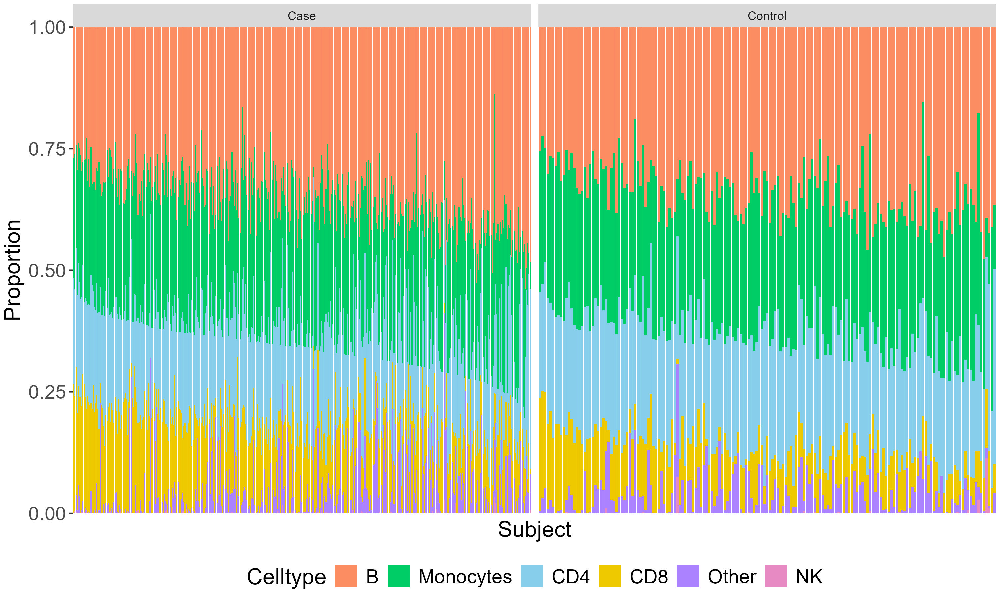
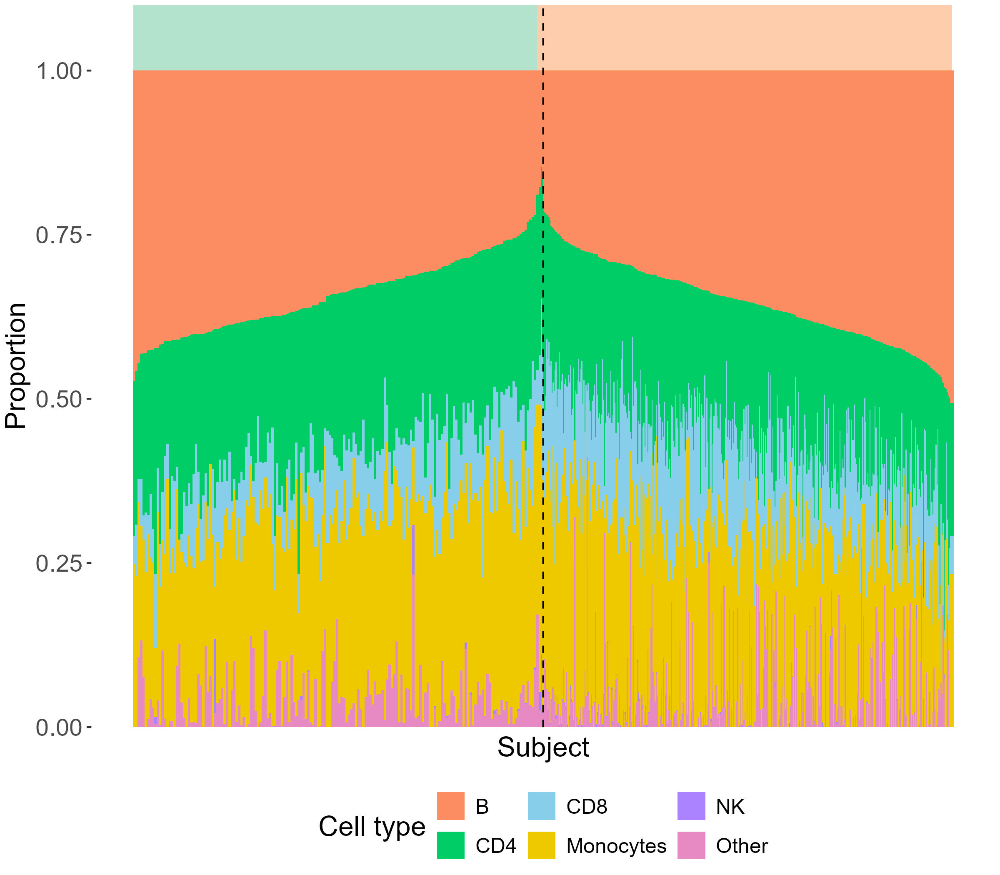
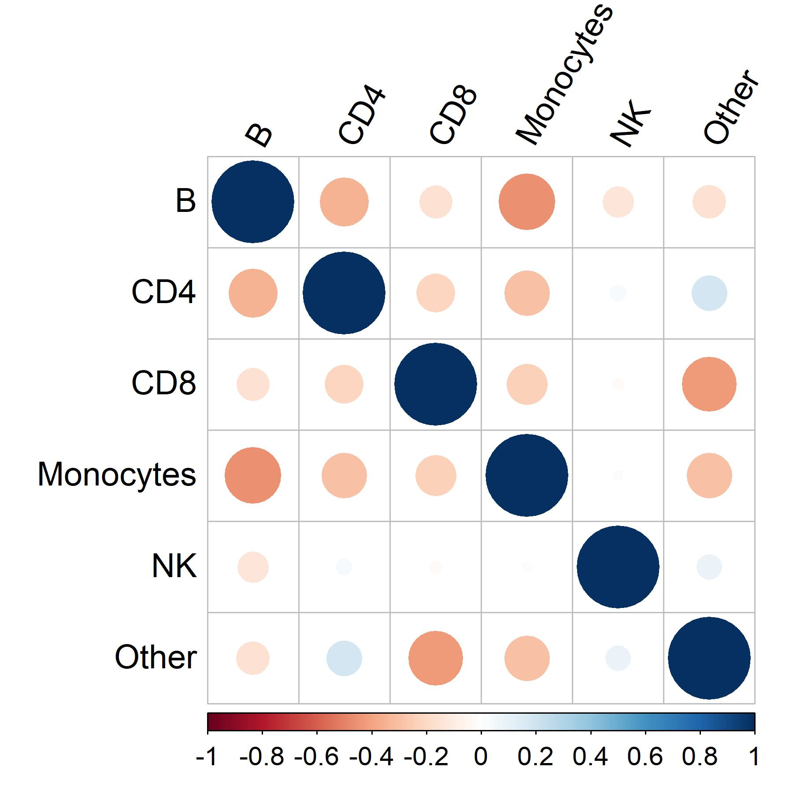
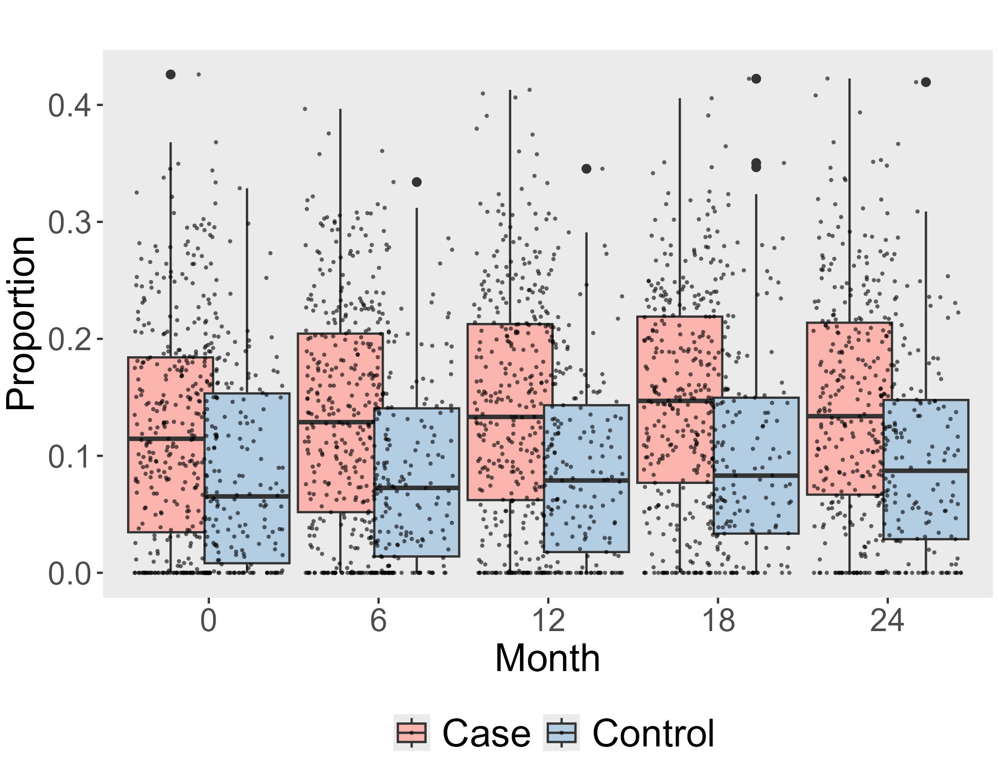
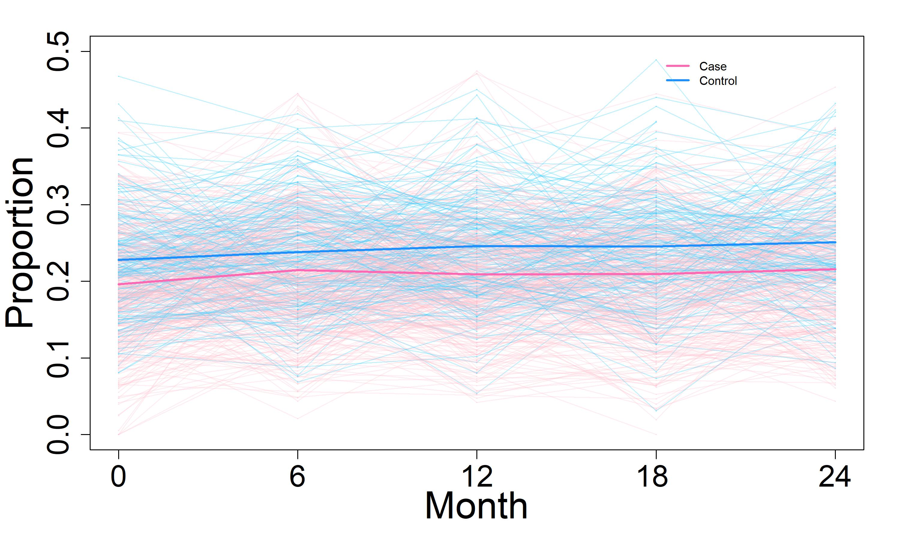
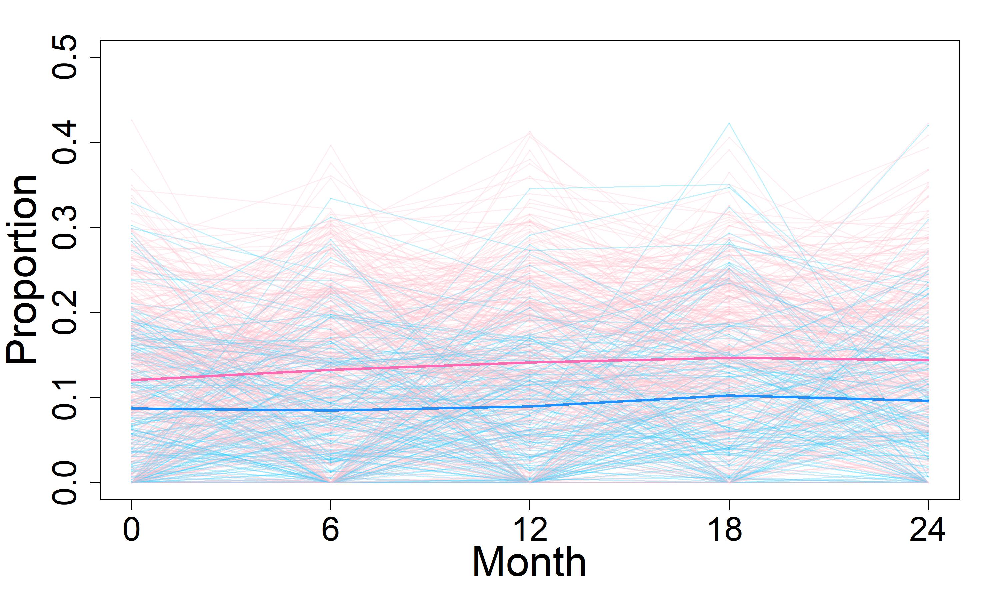
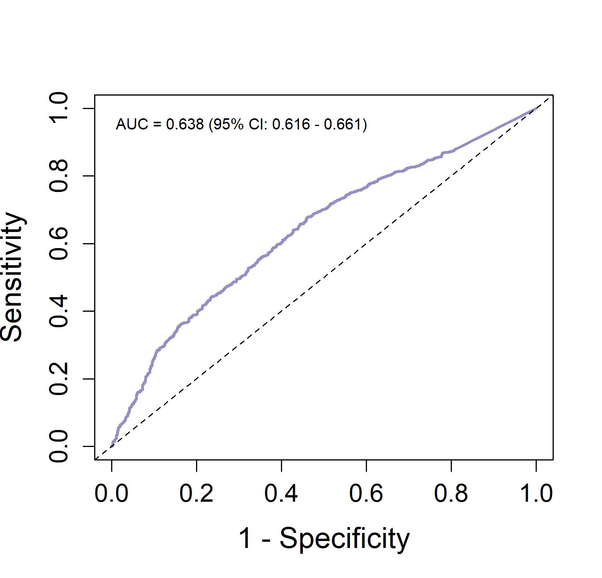
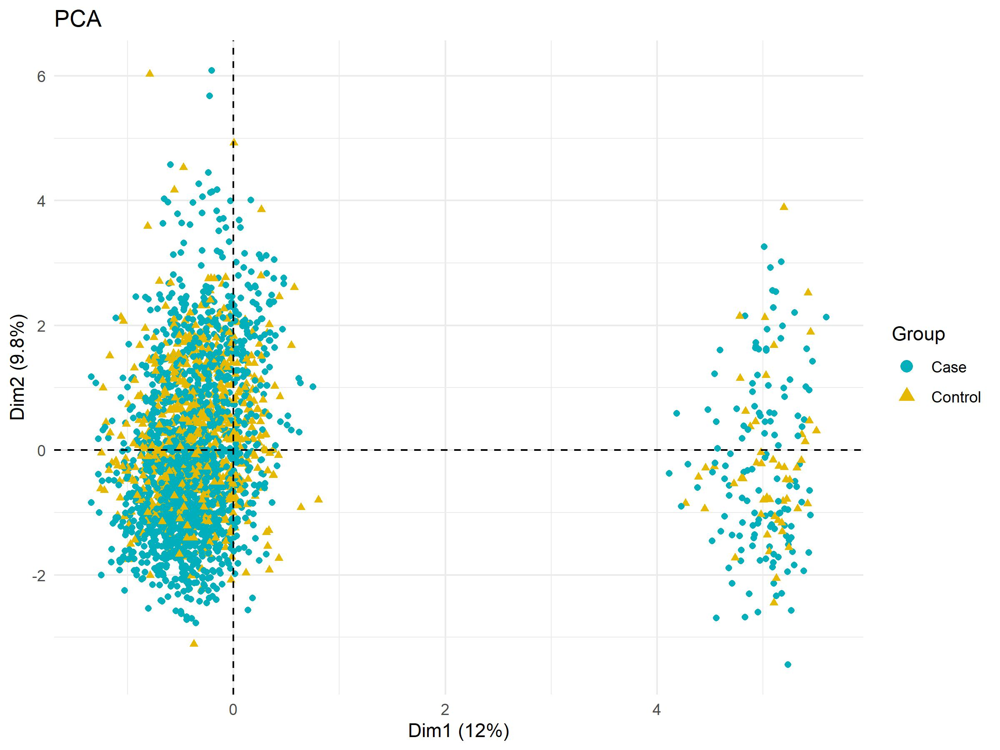
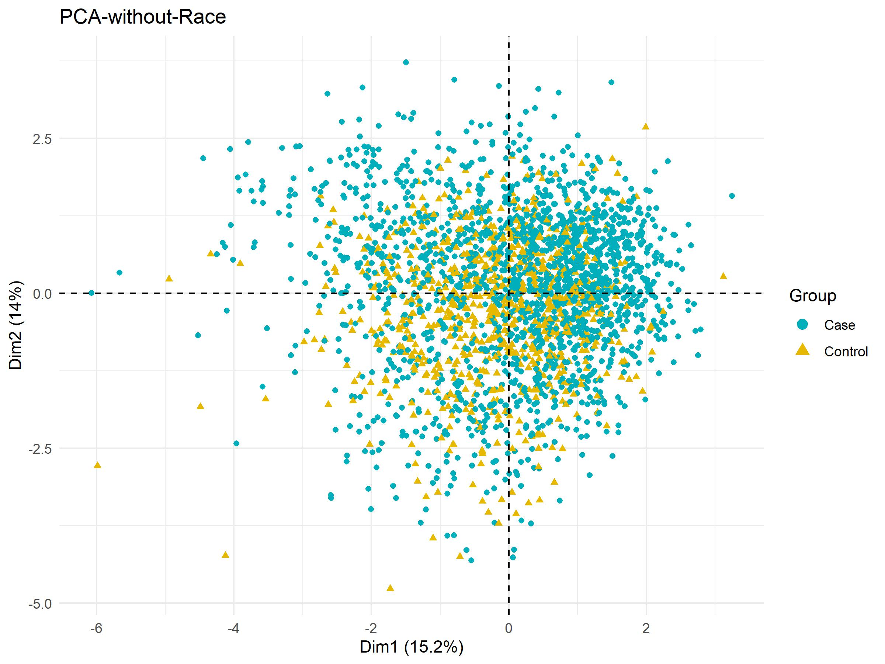
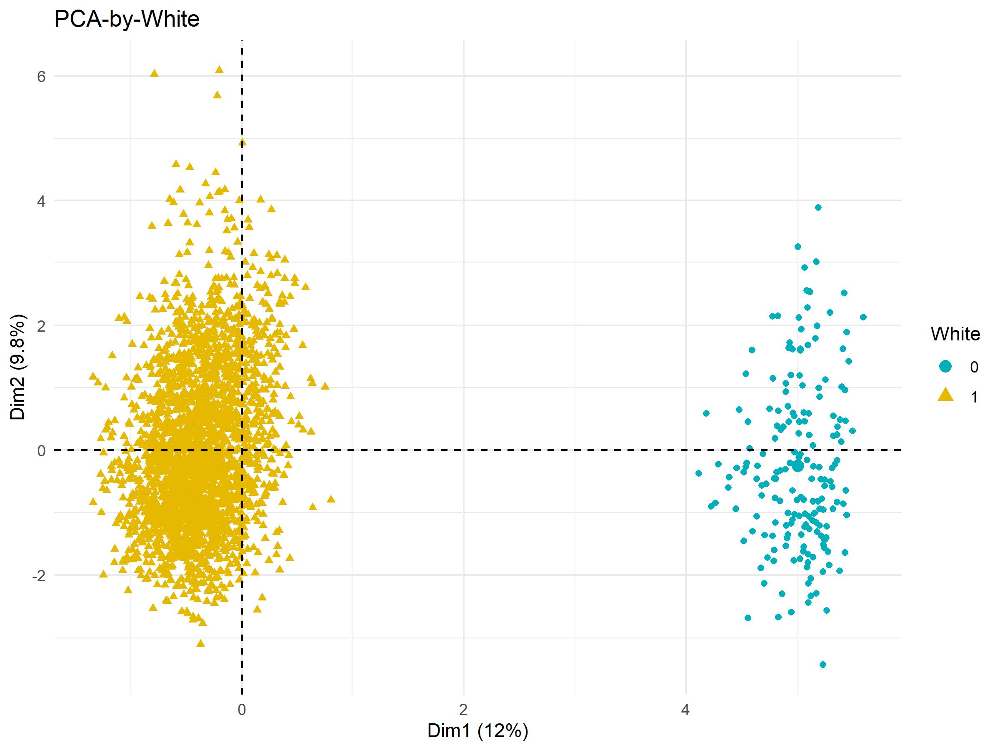

#  Overview of the Data

This project contains an analysis that combines both the demographic dataset and the cell type proportion dataset on Parkinson's Disease. The origin dataset is collected from Accelerating Medicines Partnership Parkinson's Disease in a Parkinson’s Disease Biomarkers Program (PDBP study). 
The PDBP Consortium has a collection of repeated-measures RNA-seq datasets, and demographic, and clinical information collected between November 2012 and August 2018 from patients with and without Parkinson's disease (PD) recruited from multiple medical centers and research institutions in the United States.
The analysis in this project is based on processed data, where cell type deconvolution was performed using algorithms from the 'imply' package to calculate cell type proportions, excluding the RNA-seq datasets. 
Cell Type Proportions: Contains columns representing the proportions of various cell types such as B cells, CD4 and CD8 T cells, Monocytes, NK cells, and other miscellaneous cell types.
Metadata: Includes participant and sample identifiers, along with several demographic and clinical variables like visit month, case/control status, age at baseline, sex, ethnicity, race, education level, tobacco/alcohol use, and caffeine consumption.

## Key Points of Interest

- **Longitudinal Data**:  
  The PDBP data were collected longitudinally over time for each subject, allowing for the tracking of changes in cell type composition across multiple visits.

- **Classification Models**:  
  Classification models can be applied to the data to analyze the performance of certain biomarkers.

- **Visualizations**:  
  Visualizations are included that show the correlation between cell type proportions, providing insights into immune cell dynamics in the context of Parkinson’s Disease.

- **Principal Component Analysis (PCA)**:  
  We applied Principal Component Analysis to test the clustering patterns when excluding RNA-seq data and using only demographic data and cell type proportion data. This analysis aimed to explore whether cell type proportion is representative in Parkinson’s Disease.

- **Makefile Workflow**:  
  A Makefile is used to integrate the results of all analyses, ensuring efficient and reproducible workflows.

## Data Origin

The original bulk transcriptome and associated clinical data are part of the PDBP and are publicly available upon request through the [AMP-PD website](https://amp-pd.org). These data can be accessed for research purposes with the proper application and approval.

Below are Cell type proportions for all subjects, separated by Parkinson’s disease (PD) status. The bar represents the mean cell type proportions across all visit times, for each subject.

The sort data more directly show the comparison of cell type proportions between cases and controls.

The correlation plot shows Pearson correlations of cell type proportions between six cell types, among all individuals.
B cells, monocytes, and CD4 all show negative pairwise correlations

# Longitidindal data analysis

The boxplot shows the CD8 cell type proportions comparing case and control, at each time point. The median value of the CD8 proportion in this case is higher than that in the control group at each time point.
The variance in the Case group is higher than in the Control group. From the boxplot we find a significant difference between the two groups, we can also find it is hard to classify the patients based on CD8 only which is the most significant cell-type proportion variable.

The timeline graph shows the CD4 and CD8 cell type proportions for each subject, broken down by visit time. For the CD4 cell type, the cases had a lower mean proportion than the controls at each visit. For the CD8 cell type, the cases had a higher mean proportion than the controls at each visit. There was no significant change in the cell type proportions over time.

# receiver operating characteristic 
The receiver operating characteristic (ROC) curve shows the classification performance when we use the CD8 ratio to classify patients. We also show the AUC and its 95% CI. In this case, the AUC of 0.638 indicates a moderate discriminative ability, where CD8 has some significance in clinical diagnosis.

#  Principal Component Analysis (PCA)

## PCA setting
We excluded variables with more than 30% missing or unknown data, current smoking, current alcohol consumption, and current and previous coffee consumption. We then converted all categorical data into binary data. We set all unknowns in binary variables to 0 and “yes” to 1. A total of 9 demographic variables and 6 cell-type proportion variables were included in the PCA

## PCA results

We identified two distinct clusters based on the available data. Although the distribution of CD4 and CD8 ratios was different between the case and control groups, these variables did not seem to contribute significantly to the clustering. After performing a PCA and excluding the most influential factor, race, the resulting clusters did not show any meaningful pattern.

In the subsequent PCA, we grouped the data based on the race variable "white", which showed the strongest influence, and the clusters became apparent. This result suggests that race, and specifically the variable "white", is the main driver of the clusters observed in the data.

#  Discussion
Our analysis showed that cell type ratios are important variables for understanding differences between Parkinson's disease patients and controls. Specifically, CD4 and CD8 ratios were significantly different between patients and controls, and there is potential value in distinguishing patients based on these ratios. Numerous studies have shown that incorporating cell ratio information can more accurately and effectively identify differentially expressed genes (DEGs).

However, relying solely on cell type ratios without gene-level information (RNA and DNA) or demographic factors such as race does not effectively help diagnose patients. When these key information are excluded, clustering results lose meaningful interpretability.

Our findings further highlight the significant differences in disease-related analyses between different ethnic groups, emphasizing the importance of considering ethnic diversity. This is consistent with the results reported in many previous studies.

# Reference

1. Ortega, C., Andrade, J., Krystkowiak, M., Riccio, D., Collas, P., Becker, C. G., Ayer-Le, L., Lévesque, M. J., Deprez, A., Brown, B., ... (2024). Integrative omics analyses of synucleinopathies and Alzheimer’s disease reveal distinct microglial patterns. *Genome Medicine, 16*(1), Article 16. https://doi.org/10.1186/s13073-024-01338-z

2. Virtanen, P., Helske, S., & Salmela, M. (2024). Structural equation modeling and computational advances for epigenetic networks. *Bioinformatics, 40*(8), btae511. https://doi.org/10.1093/bioinformatics/btae511

3. National Institutes of Health. (2017). Parkinson’s Progression Markers Initiative (PPMI). *dbGaP Study phs001442.v4.p3*. Retrieved from https://www.ncbi.nlm.nih.gov/projects/gap/cgi-bin/study.cgi?study_id=phs001442.v4.p3

4. Gingold, J. A., Detmar, A. R., & Wu, J. J. (2023). A meta-analysis framework for predicting genomic regulatory regions. *Genome Biology, 24*(1), Article 22. https://doi.org/10.1186/s13059-023-03014-8

5. Rayaprolu, S., Barger, S., Diaz-Garcia, A., & Chia, R. (2020). Glial gene variations implicated in Parkinson’s disease progression: A comprehensive review. *Brain, 143*(12), 3717–3736. https://doi.org/10.1093/brain/awaa271